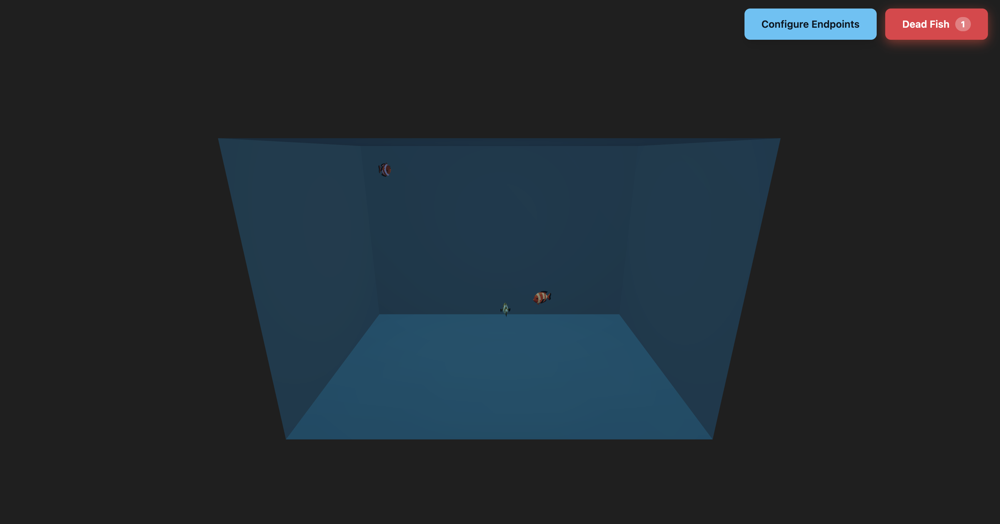
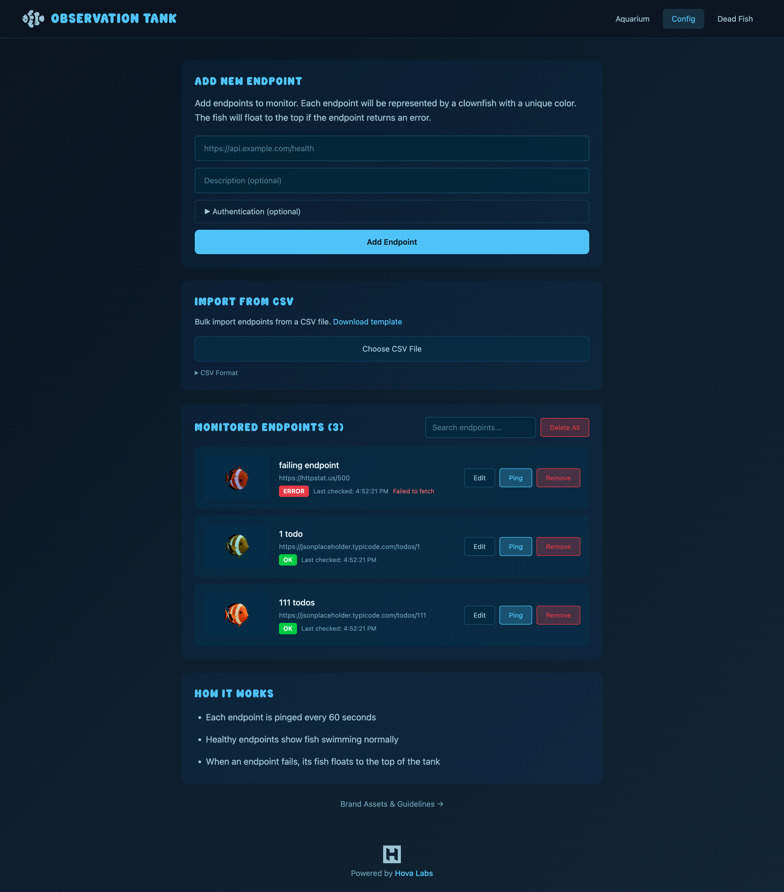
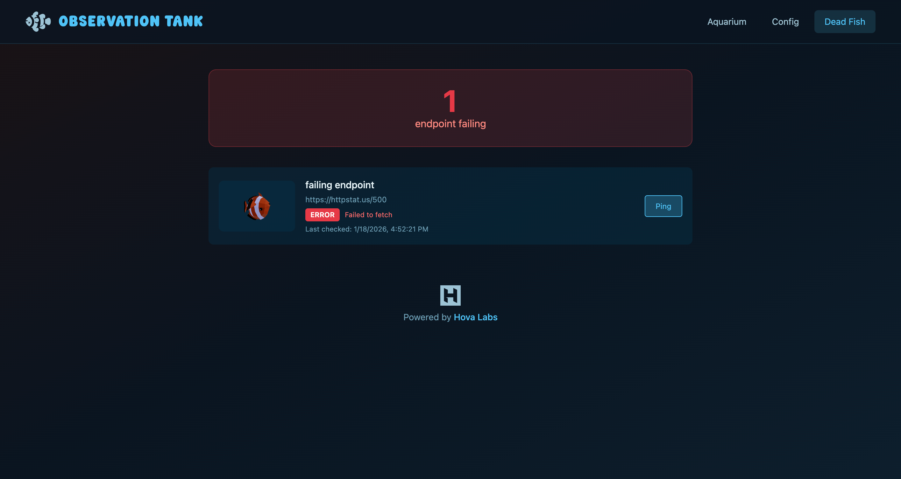

# Observation Tank

Tired of staring at dashboards during on-call shifts? Let Observation Tank make on call more fun — your endpoints swim as fish, and when something goes down, you'll know when fish go belly up.

## Getting Started

```bash
npm install
npm run dev
```

## How to Use

Configure your endpoints at `/config` or import them via CSV (See public/TEMPLATE_ENDPOINT_IMPORT.csv).

You can click on fish in the tank to see what URL they represent and click them again to remove the URL.

## Screenshots



Zoom in + Pan around to position the aquarium to fill your whole screen





## Acknowledgments

Fish animation by [Denys Almaral](https://sketchfab.com/3d-models/clown-fish-low-poly-animated-af7ba2aa41d2413098a59b21cfda79c2)
